<div align="center">
  
  # WargaTech
  ### Solusi Inovatif untuk Warga Kreatif
  
  [](https://wargatech.my.id)
  [](https://github.com/mfnteam/Wargatech)
  [](LICENSE.txt)
  
  **Submission for ITECHNO CUP 2026 - Web Development**
  
  **By MFN Company**
  
</div>

---

## 📋 Daftar Isi

- [Tentang Proyek](#-tentang-proyek)
- [Fitur Unggulan](#-fitur-unggulan)
- [Demo & Screenshot](#-demo--screenshot)
- [Teknologi](#-teknologi)
- [Arsitektur Sistem](#-arsitektur-sistem)
- [Instalasi & Setup](#-instalasi--setup)
- [Penggunaan](#-penggunaan)
- [API Documentation](#-api-documentation)
- [Testing](#-testing)
- [Tim Developer](#-tim-pengembang)
- [Lisensi](#-lisensi)

---

## 👥 Tim Developer

| Nama             | Peran                              | GitHub                                        |
| ---------------- | ---------------------------------- | --------------------------------------------- |
| Muhammad Fathar  | Project Lead, Fullstack Developer, | [GitHub](https://github.com/thundergaming349) |
|                  | & Machine Learning                 |                                               |
| Masla Adinata    | Frontend Developer                 | [GitHub](https://github.com/MaslaAdinata)     |
| Muhammad Nazriel | UI/UX Designer                     | [GitHub](https://github.com/[username3])      |

---

## 🎯 Tentang Proyek

### Latar Belakang

Seringkali kita melihat suatu masalah yang ada di kota, mau itu kerusakan infrastruktur seperti jalan berlubang, rusaknya fasilitas umum, maupun sampah yang ada dimana mana. Kemudian selama ini, akses layanan publik cenderung merepotkan. Warga harus mengunduh dan menggunakan aplikasi yang berbeda-beda hanya untuk melaporkan jalan berlubang, mengecek jadwal bus, atau mendaftar antrean puskesmas. Tentu hal ini membuat warga terutama pendatang dari luar merasa proses yang dilakukan sangat tidak efisien karena sulitnya mengakses dari satu layanan ke layanan lain. Kemudian, kesadaran masayarakat dalam memilah sampah masih sangat minim. Banyak ruangan publik yang menyediakan 4 tempat sampah untuk jenis yang berbeda, namun masih saja ada sampah yang dibuang tidak sesuai jenisnya.

Oleh karena itu, kami memanfaatkan semua masalah tersebut untuk kami kembangkan dan kami evaluasi menjadi sebuah aplikasi bernama **WargaTech**. WargaTech adalah aplikasi berbasis web dengan mewujudkan konsep **Smart City** untuk kota Jakarta. Berbagai layanan bisa anda rasakan hanya dengan 1 platform, mulai dari laporan warga, mendaftar layanan kesehatan, hingga teknologi AI yang bisa mendeteksi jenis sampah secara otomatis. Hal ini tentu akan memudahkan warga untuk menggunakan layanan kota dengan lebih efisien, cepat, dan tepat.

### Solusi yang Ditawarkan

Kami menerapkan konsep **Smarty City** yang memiliki 4 fitur utama dalam 1 platform. Dimulai dari **Easy Reporting** yang memudakan warga untuk melaporkan masalah untuk diselesaikan. **Digital Healthcare** untuk membuat perjanjian dengan suatu layanan kesehatan. **Digital Urban Transpor** yang dimana warga bisa melihat jadwal dari berbagai layanan transportasi umum. dan **Smart Waste Category** yang memanfaatkan teknologi berbasis AI untuk mendeteksi jenis jenis sampah.

### Tujuan Proyek

- 🎯 **Tujuan Utama**: Kami ingin warga di Kota jakarta ini dapat melaporkan masalah kota dengan mudah dan efisien tanpa mengalami kesulitan, kemudahan dalam mengakses jadwal transportasi umum, serta Menawarkan kemudahan dalam membuat perjanjian dokter/layanan kesehatan dengan UI yang mudah dimengerti disemua kalangan usia, mulai dari anak anak hingga gen boomer yang terkenal dengan generasi gaptek (gagap teknologi)

- 📊 **Target Pengguna**: Warga Jakarta yang menetap, merantau, maupun pendatang dari semua daerah.

- 💡 **Value Proposition**: Kami menawarkan fitur laporan apabila terdapat suatu masalah di kota. Serta kami memanfaatkan teknologi AI untuk memilah jenis jenis sampah menjadi 4 bagian (Organik, Anorganik, Limbah B3, dan Residu) dengan hanya satu klik. Dan kamu ingin warga dapat melihat jadwal transportasi terdekat dari waktu kita saat ini, jadi kita mengetahui transportasi apa yang paling efisien untuk kita gunakan dalam kebutuhan sehari hari.

---

## ✨ Fitur Unggulan

### Fitur Utama

| Fitur                 | Deskripsi                        | Keunggulan                         |
| --------------------- | -------------------------------- | ---------------------------------- |
| Laporan Kota          | Fitur yang berfungsi untuk       | Karena warga dapat melapor suatu   |
|                       | Melaporkan berbagai masalah      | masalah dengan mengisi formulir    |
|                       | yang ada di kota.                | tanpa menunggu pihak berwajib      |
|                       |                                  | untuk meninjau lokasi              |
|                       |                                  |                                    |
| Layanan Kesehatan     | Warga dapat membuat perjanjian   | Warga dapat membuat perjanjian     |
|                       | dengan dokter/layanan kesehatan  | dengan mengisi tanggal dan waktu   |
|                       | di seluruh Jakarta               | perjanjian kemudian tunggu hingga  |
|                       |                                  | petugas mengonfirmasi perjanjian   |
|                       |                                  |                                    |
| Mobilitas Sosial      | Melihat jadwal transportasi umum | Agar warga terutama para pekerja   |
|                       | lengkap dari ke 4 jenis transum  | atau pendatang dapat mengetahui    |
|                       | yang ada di jakarta, mulai dari  | jadwal transportasi umum yang akan |
|                       | KRL, Transjakarta, MRT, dan LRT  | mereka gunakan.                    |
|                       |                                  |                                    |
| Stabilitas Lingkungan | Melihat infografis tentang jenis | Warga dapat mengetahui jenis jenis |
|                       | sampah serta menggunakan sistem  | sampah secara efisien dengan hanya |
|                       | AI untuk mengetahui jenis jenis  | 1 klik.                            |
|                       | sampah secara langsung.          |                                    |

### Fitur Tambahan

- **Login** - Autentikasi pengguna sebelum menggunakan fitur utama
- **Foto Profil** - Pengguna dapat mengubah foto profil akun mereka
- **Mengubah Data Diri** - Pengguna dapat mengubah data diri mereka (kecuali email & password)
- **Verifikasi** - Verifikasi kode saat pertama kali menggunakan akun

---

## 📸 Demo & Screenshot

### Live Demo

#### Akun Dummy

-----Petugas-----
Email : admin.wargatech@gmail.com
Password: admin123

------Warga------
Email: member.wargatech@gmail.com
Password: member123

🔗 **[Kunjungi Website](https://wargatech.my.id)**

### Screenshot Aplikasi

<div align="center">
  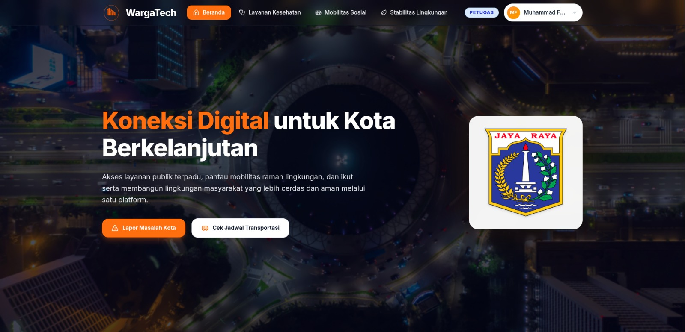
  <p><em>Dashboard - Tampilan utama aplikasi</em></p>
  
  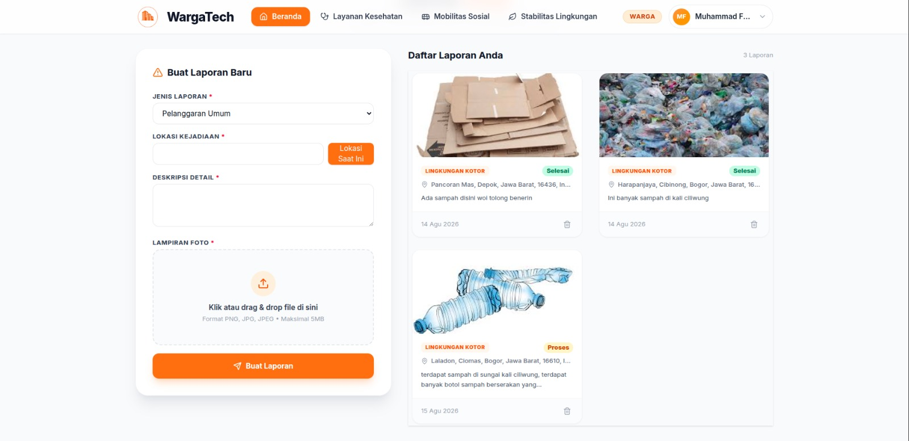
  <p><em>Report - Tampilan form laporan</em></p>
  
  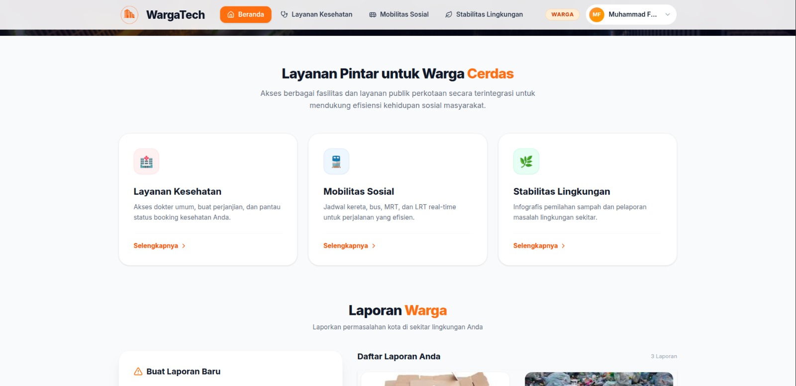
  <p><em>Features - Daftar fitur pada aplikasi</em></p>

  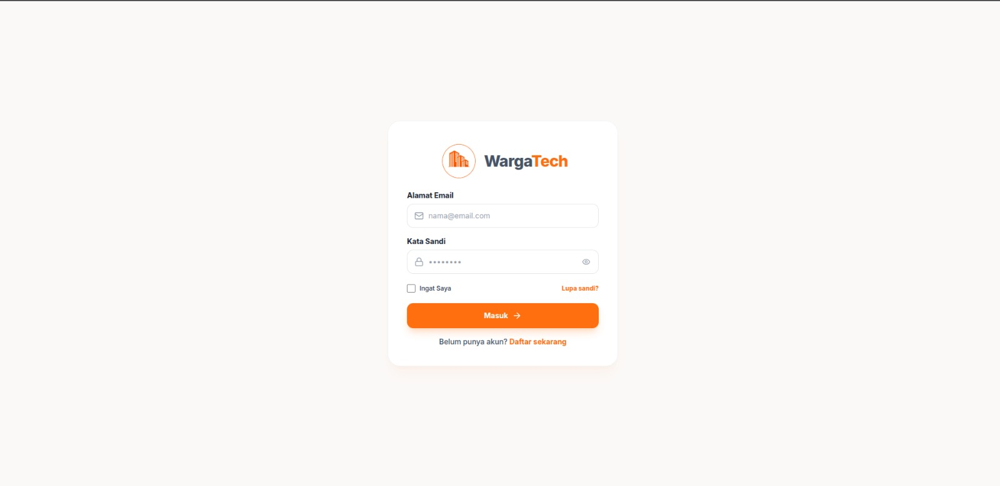
  <p><em>Login - Tampilan login</em></p>

  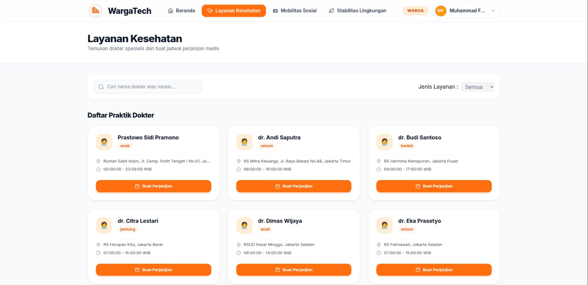
  <p><em>Kesehatan - Mnampilkan daftar dokter</em></p>

  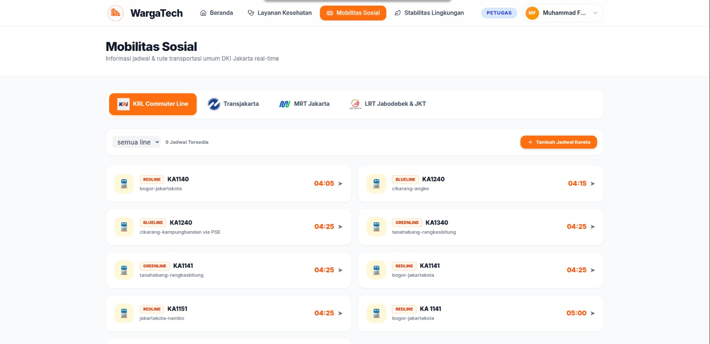
  <p><em>Train - Menampilkan daftar kereta</em></p>

  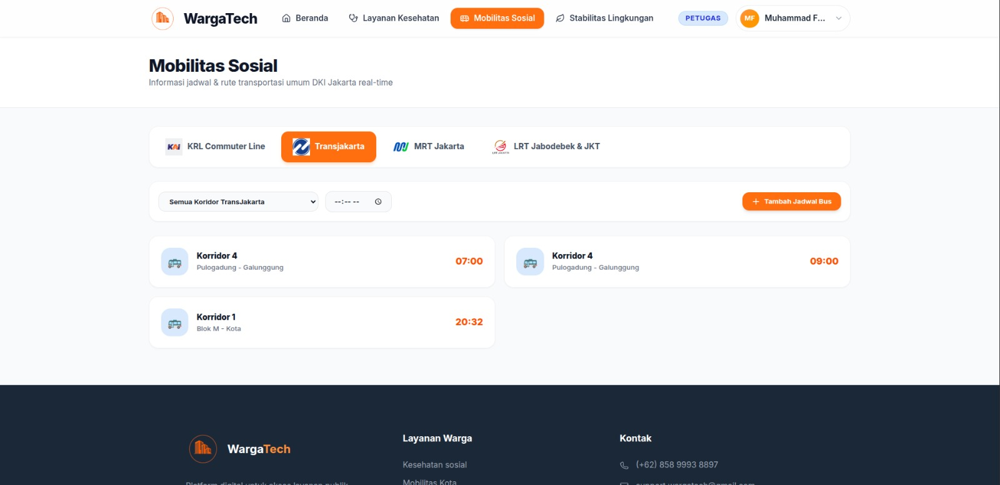
  <p><em>Busway - Menampilkan daftar busway</em></p>
  
  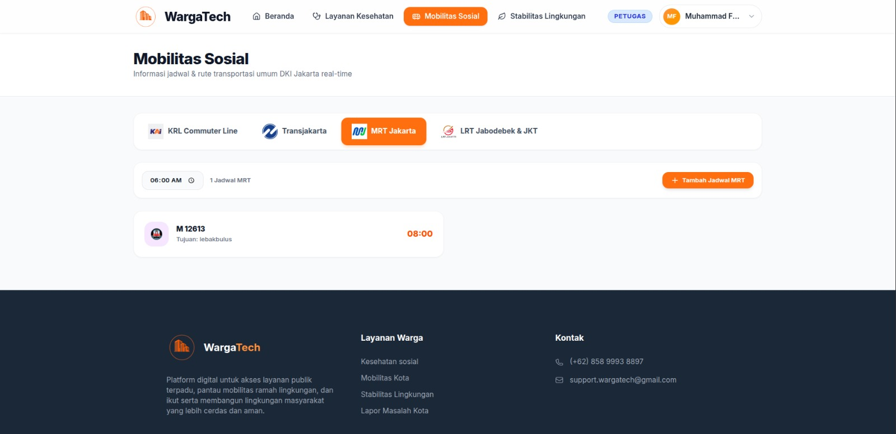
  <p><em>MRT - Menampilkan daftar MRT</em></p>
  
  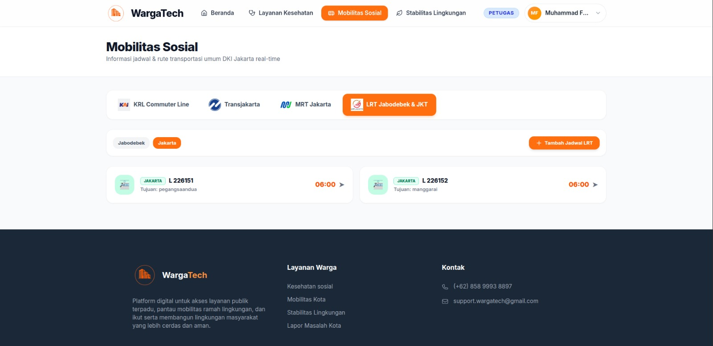
  <p><em>LRT - Menampilkan daftar LRT</em></p>

  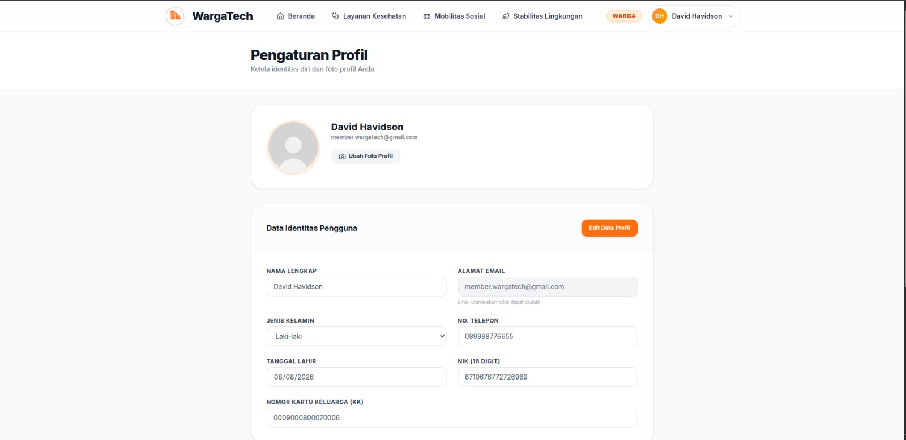
  <p><em>Profile - Pengaturan profil dan foto profil</em></p>

  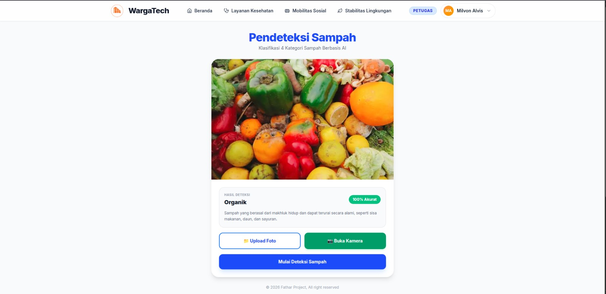
  <p><em>SampahinAja - Pendeteksi sampah AI</em></p>

  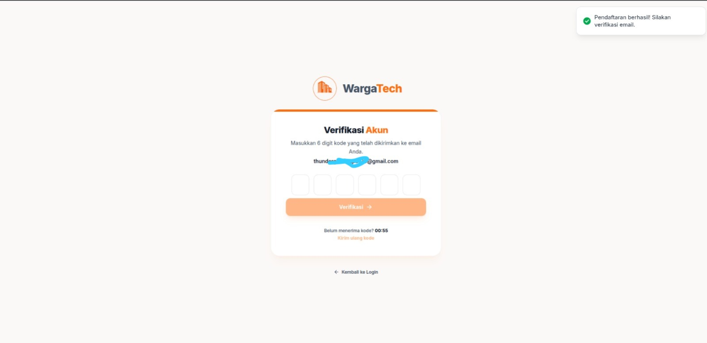
  <p><em>Verification - Verifikasi kode</em></p>
</div>

### Video Demo

📹 **[Link Video Demo](https://drive.google.com/file/d/1Gyz1eZBH-u-NoPwtGMLov3Vy335zxhHo/view?usp=drive_link)**

---

## 🛠️ Teknologi

### Tech Stack

#### Frontend

```
Framework    : React.js
UI Library   : [Tailwind CSS, Lucide-React]
State Mgmt   : useState
Validation   : -
Fetching     : Axios
```

#### Backend

```
Runtime      : PHP Runtime
Framework    : Laravel
Database     : PostgreSQL
ORM          : Laravel Eloquent
Auth         : Sanctum
```

#### DevOps & Tools

```
Deployment   : VPS Docker
CI/CD        : Github Actions
Testing      : [Postman, Vitest]
Monitoring   : Cloudflare
```

### Alasan Pemilihan Teknologi

| Teknologi  | Alasan Pemilihan                                                                 |
| ---------- | -------------------------------------------------------------------------------- |
| Laravel    | Laravel merupakan framework multifungsi yang paling mudah dipelajari dan         |
|            | banyak digunakan oleh para developer saat mengembangkan website terutama         |
|            | untuk REST API. Dengan penggunaan validator hingga Mailing yang mudah            |
|            | menjadikan Laravel adalah framework backend yang kami gunakan.                   |
|            |                                                                                  |
| React      | React adalah framework frontend yang mudah dipelajari oleh developer             |
|            | frontend pemula. React juga memiliki banyak library serbaguna untuk meningkatkan |
|            | tampilan dan performa website kamu. Kemudahan syntax yang digunakan juga         |
|            | menjadikan salah satu alasan penggunaan framework ini.                           |
|            |                                                                                  |
| PostgreSQL | PostgreSQL adalah database yang terlihat seperti MySQL, seperti syntaxnya        |
|            | yang sangat mirip dengan MySQL. Namun Postgre memiliki kualitas yang jauh        |
|            | lebih baik daripada MySQL itu sendiri, cara melakukan query yang lebih baik      |
|            | membuat PostgreSQL ini merupakan salah satu database yang kami gunakan           |
|            | untuk meningkatkan pengalaman pengguna dalam mengirim suatu query dengan         |
|            | cepat dan efisien.                                                               |

### Dependencies Utama

```json
{
    "dependencies": {
        "@tailwindcss/vite": "^4.3.3",
        "axios": "^1.19.0",
        "bootstrap": "^5.3.8",
        "lucide-react": "^1.31.0",
        "react": "^19.2.8",
        "react-dom": "^19.2.8",
        "react-hot-toast": "^2.6.0",
        "react-router-dom": "^7.18.2",
        "tailwindcss": "^4.3.3"
    }
}
```

---

## 🏗️ Arsitektur Sistem

### System Architecture

<div align="center">
    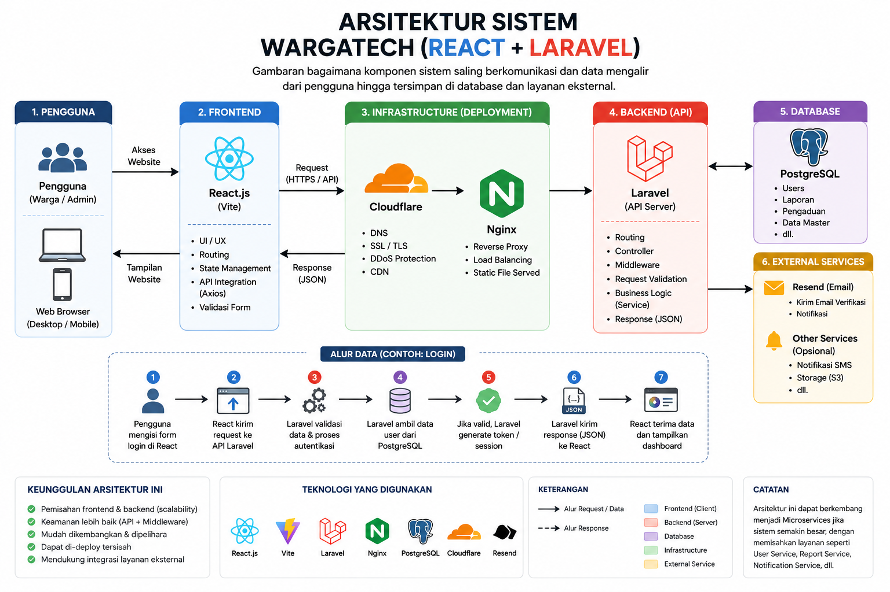
</div>

### Database Schema

<div align="center">
    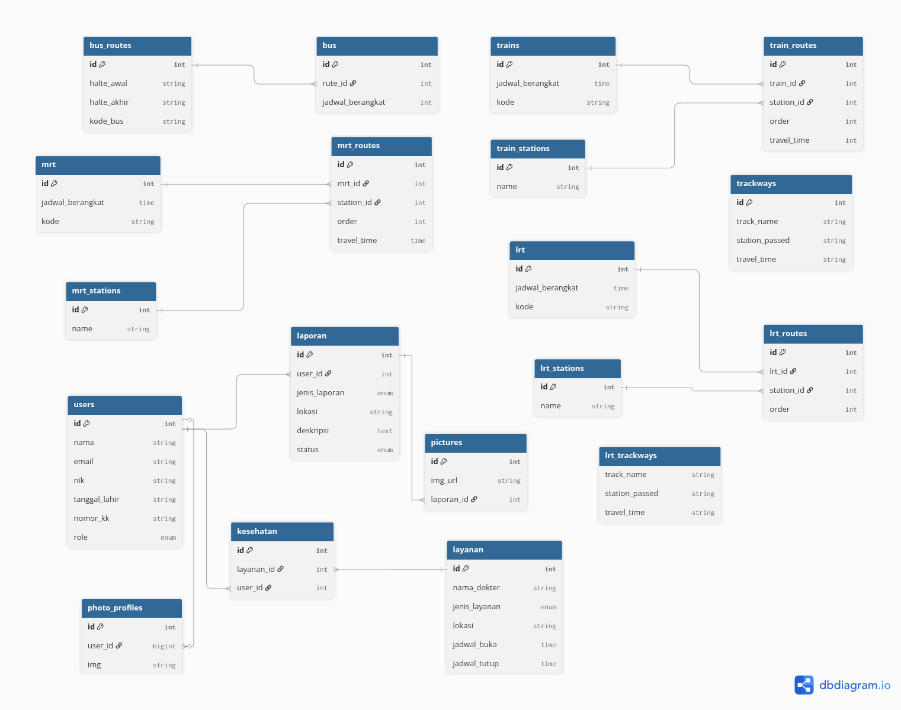
</div>

### Folder Structure

#### Backend

```
Wargatech_be/
├── app/
│   ├── Helper/                 # Fungsi bantuan secara global
│   ├── Http/
│   │   └── Controllers/
│   │       ├── Auth/           # Controller untuk atentikasi (login, register, verify)
│   │       ├── Mobility/       # Controller untuk fitur mobilitas
│   │       ├── Profile/        # Controller untuk manajemen profil pengguna
│   │       ├── Report/         # Controller untuk pengelolaan laporan
│   │       ├── Service/        # Controller untuk layanan kesehatan
│   │       └── Controller.php
│   ├── Mail/                   # Untuk pengiriman email seperti kode OTP
│   ├── Models/                 # Struktur data dan interaksi dengan tabel database
│   └── Providers/              # Pengaturan awal layanan aplikasi (Service Providers)
│
├── bootstrap/
├── config/
├── database/
│   ├── factories/              # Membuat data dummy untuk pengujian
│   ├── migrations/             # Pembuatan struktur dan relasi database
│   ├── seeders/                # Pengisian data awal ke dalam database
│   └── database.sqlite
│
├── public/
│   ├── images/                 # Menyimpan file gambar secara publik
│   └── storage/                # Menyimpan file ke direktori storage aplikasi
│
│
├── resources/                  # Folder mentah frontend (Blade)
├── routes/                     # Membuat endpoint pada aplikasi
├── storage/
└── tests/
```

#### Frontend

```
WargaTech_frontend/
├── public/                 #Aset publik
└── src/
    ├── assets/             #Aset statis
    ├── components/
    │   ├── common/         #Komponen yang digunakan pada 1 pages tertentu
    │   └── layout/         #Komponen yang digunakan berulang kali
    ├── context/            #Membuat konteks sistem yang digunakan secara global
    ├── pages/
    │   ├── auth/           #Halaman Autentikasi
    │   ├── environment/    #Halaman Stabilitas Lingkungan
    │   ├── health/         #Halaman Layanan kesehatan
    │   ├── home/           #Halaman Utama (Dashboard)
    │   ├── mobility/       #Halaman Mobilitas Sosial
    │   └── settings/       #Halaman pengaturan
    ├── services/           #Sistem utama dalam proses request ke API
    ├── App.jsx
    ├── index.css
    └── main.jsx            #Komponen utama
```

---

## ⚙️ Instalasi & Setup

### Prerequisites

Pastikan Anda telah menginstall:

- **Node.js** (v20.x atau lebih tinggi)
- **npm**
- **PostgreSQL** (v18.x atau lebih tinggi)
- **Composer** (v2.5^ keatas)
- **PHP** (v8.3^ keatas)
- **Python** (v3.10^ keatas)
- **Git**

### Langkah Instalasi

#### Backend

##### 1. Clone repository github

```Terminal/CMD

git clone https://github.com/mfnteam/wargatech_be
cd wargatech_be


```

##### 2. Intsall composer

```Terminal/CMD

Composer install


```

##### 3. Setup postgre database

```
createdb -U postgres {nama_database}

```

##### 4. Buat .env laravel

```Terminal/CMD

copy .env.example .env
php artisan key:generate
php artisan install:api


```

##### 5. Setup .ENV

```
isi .env laravel

#APP
APP_NAME=WargaTech
APP_ENV=local
APP_KEY={sudah generate otomatis}
APP_DEBUG=true
APP_URL=http://localhost:8000

#DATABASE
DB_CONNECTION=pgsql
DB_HOST=127.0.0.1
DB_PORT=5432
DB_DATABASE=wargatech
DB_USERNAME=laravel
DB_PASSWORD=password123

#MAIL
MAIL_MAILER=smtp
MAIL_HOST=smtp.gmail.com
MAIL_PORT=465
MAIL_ENCRYPTION=tls
MAIL_USERNAME=support.wargatech@gmail.com
MAIL_PASSWORD=afbkjnnclrhuilea
MAIL_FROM_ADDRESS="support.wargatech@gmail.com"
MAIL_FROM_NAME="${APP_NAME}"

```

##### 6. Jalankan migrasi dan seeder

```Terminal/CMD
php artisan migrate:fresh

php artisan db:seed TrainStatSeeder
php artisan db:seed BusStation
php artisan db:seed LrtSeeder
php artisan db:seed MrtStation
php artisan db:seed TrackSeeder
php artisan db:seed DoctorSeeder

```

##### 7. Jalankan dump-autoload dan storage link

```Terminal/CMD
composer dump-autoload
php artisan storage:link

```

##### 8. Jalankan backend

```
php artisan serve  #Server backend akan berjalan di http://localhost:8000

```

#### Frontend

##### 1. Clone repository dari github

```Terminal/CMD
git clone https://github.com/mfnteam/WargaTech_frontend
cd WargaTech_frontend

```

##### 2. Install package

```Terminal/CMD
npm install

```

##### 3. Jalankan dalam development mode

```
npm run dev  #Server akan berjalan di http://localhost:5173

```

#### Python

##### 1. Clone repository dari github

```Terminal/CMD
git clone https://github.com/mfnteam/SampahinAja
cd SampahinAja

```

#### 2. Install library

```Terminal/CMD
pip install fastapi "uvicorn[standard]" python-multipart pillow tensorflow numpy
uvicorn app:app --reload

```

#### 3. Jalankan python

```Terminal/CMD
python app.py                   #AI anda akan berjalan di http://localhost:5000
python3 app.py (untuk linux)

```

---

## 🚀 Penggunaan

### Menjalankan Aplikasi

```bash
# Backend
cd wargatech_be
php artisan serve

--------------------------

#frontend
cd WargaTech_frontend

##development mode
npm run dev

##build mode
npm run build
npm run start

##test mode
npm run test

--------------------------

#python AI
cd SampahinAja
python app.py

python3 app.py (untuk linux)

```

### User Guide

#### Untuk Pengguna Umum

---

Email: member.wargatech@gmail.com
Password: member123

---

1. **Registrasi/Login**: Untuk mendaftar, anda harus mengisi field Nama, Email, Tanggal Lahir, NIK, No.KK, No. Telepon, Jenis Kelamin, dan password lalu klik daftar. anda akan otomatis diarahkan ke page verify untuk memverifikasi email melalui kode OTP yang dikirimkan ke email anda. Untuk login cukup masukkan email dan password, apabila email belum di verifikasi, maka pengguna akan otomatis diarahkan ke halaman verify untuk memverifikasi email yang sudah di daftarkan.

2. **Laporan Warga**: Anda cukup memilih jenis laporan, kemudian isi alamat dan deskripsi lalu sertakan gambar. Apabila anda tidak tahu alamat spesifik tempat kejadian, terdapat tombol "lokasi saat ini" untuk langsung mendeteksi lokasi anda saat ini secara **realtime**, kemudian klik "kirim laporan". Laporan yang sudah dilaporkan akan tersedia di bagian kanan dari formulir.

3. **Perjanjian Dokter**: Terdapat fitur search untuk mencari alamat atau nama dokter, apabila ingin memilih berdasarkan kategori, terdapat pilihan kategori yang ingin dipilih di sebelah kanan. Apabila menemukan dokter yang cocok, klik tombol "buat perjanjian" dan isi tanggal, serta jam pertemuan. Apabila sudah dikirim, terdapat riwayat perjanjian beserta status perjanjian anda dengan dokter tersebut.

4. **Melihat Jadwal Transportasi**: Pergi ke menu Mobilitas Sosial, terdapat 4 jenis transportasi. Anda bisa memilih jenis transportasi apa yang ingin dilihat. Untuk kereta, dan LRT, anda dapat melihat detail perjalanannya mulai dari stasiun yang dilewati, keberangkatan dari stasiun tersebut, hingga kode pada kereta yang ingin dinaiki. anda bisa mengatur filtering pada setiap transportasi. Setiap transportasi memiliki jenis "filtering" yang berbeda.

5. **Pendeteksi Jenis Sampah**: Klik tombol "coba SampahinAja" pada menu Stabilitas Lingkungan. Disitu terdapat 2 tombol yaitu "buka foto" dan "buka kamera". Untuk upload foto, anda bisa mengupload foto sampah yang ingin anda deteksi jenisnya, kemudian klik "mulai pendeteksi sampah". Untuk hasil terdapat dibawah foto, terdapat akurasi untuk menunjukkan tingkat keyakinan AI pada hasil deteksi yang dilakukan. Untuk ambil foto, anda diminta untuk mengizinkan website membuka akses kamera anda. Setelah kamera dibuka, akan muncul tombol "ambil foto" dan AI akan mulai mendeteksi sampah yang muncul pada frame kamera.

6. **Mengubah Data dan Foto**: Pergi ke pengaturan, terdapat 2 opsi perubahan. yaitu mengubah data diri (seperti nama, NIK, dan No.KK) dan ubah foto profil. Untuk mengubah foto profil, anda hanya perlu memasukkan gambar yang ingin anda jadikan foto profil dan otomatis foto profil anda akan diubah. Terkecuali untuk mengubah data diri, anda harus melakukan verifikasi terlebih dahulu sebelum mengubah data diri anda. Karena ini sangat penting untuk menjaga privasi anda dari penyalahgunaan orang lain. Kami mengedepankan sistem keamanan agar orang lain tidak dapat menyalahgunakan data anda untuk kepentingan pribadi mereka.

`

#### Untuk Admin

---

Email : admin.wargatech@gmail.com
Password: admin123

---

1. **Akses Admin Panel**: Disini admin dinamakan sebagai **Petugas**, petugas ditentukan oleh "role" pada user. Role bisa diubah dari akses database langsung sehingga tidak semua orang bisa sembarang mengubah role seseorang menjadi petugas. Apabila anda login ke user yang role nya merupakan petugas, anda bisa langsung mengakses dan menggunakan fitur admin/petugas.

2. **Kelola Laporan Warga**: Petugas bisa melihat semua laporan dari seluruh pengguna di aplikasi ini. Sebagai petugas, anda bisa mengubah status laporan yang dikirim dari "unfinished" menjadi "finished" atau selesai. Hal ini menandakan bahwa laporan sudah diselesaikan di lapangan atau belum.

3. **Kelola Perjanjian Pengguna**: Petugas dapat melihat seluruh perjanjian yang dibuat oleh warga. Sebagai petugas, anda dapat mengelola status perjanjian tersebut, sebelum anda menentukan status perjanjian, anda harus berkomunikasi dengan dokter terkait apakah jadwal yang dijanjikan itu apakah bisa hadir atau tidak. Apabila dokter menjawab tidak, maka status perjanjian bisa ditolak. Begitu sebaliknya, apabila dokter bisa hadir, maka status perjanjian bisa diterima.

4. **Menambah Transportasi**: Sebagai petugas, anda juga bisa menambahkan jadwal transportasi sesuai jam, rute, serta kode kendaraan yang diinginkan. Namun hati hati, Anda tidak bisa menghapus transportasi yang salah dan hanya bisa dihapus dari akses database. Karena jadwal transportasi ini memiliki sifat **Semi-Statis** yang bersifat mutlak dan diambil dari data dunia nyata pada jenis transportasi tersbeut.

---

## 📚 API Documentation

### Base URL

#### Backend

```

Local: http://localhost:8000/
Production: https://api.wargatech.my.id/

```

#### Frontend

```

Development: http://localhost:5173/
Production: https://wargatech.my.id

```

#### Python

Local: http://localhost:5000/
Production: https://sampahinaja-production.up.railway.app

### Endpoints

#### ❓ Authentication

```http
POST      api/auth/login
POST      api/auth/logout
POST      api/auth/register
POST      api/auth/resend
POST      api/auth/verify-email

```

#### ⚠️ Report Section

```http
POST      api/report
GET|HEAD  api/report/all-report
GET|HEAD  api/report/user-report
PUT       api/report/{id}
DELETE    api/report/{id}

```

#### 🩺 Doctor Service

```http
POST      api/service
GET|HEAD  api/service
PUT       api/service/accept-booking/{id}
GET|HEAD  api/service/all-booking
PUT       api/service/reject-booking/{id}
GET|HEAD  api/service/user-booking

```

#### Mobility

##### 🚌 Bus

```http
POST api/mobility/bus/create-bus
GET|HEAD api/mobility/bus/list-bus
GET|HEAD api/mobility/bus/list-corridor

```

##### 🚊 LRT

```http
POST api/mobility/lrt/create-lrt
GET|HEAD api/mobility/lrt/detail-lrt/{id}
GET|HEAD api/mobility/lrt/list-lrt

```

##### 🚆 MRT

```http
POST api/mobility/mrt/create-mrt
GET|HEAD api/mobility/mrt/list-mrt
GET|HEAD api/mobility/mrt/list-station

```

##### 🚂 Train

```http
POST api/mobility/train/create-train
GET|HEAD api/mobility/train/detail-train/{id}
GET|HEAD api/mobility/train/list-station
GET|HEAD api/mobility/train/list-train

```

#### 👤 Profile

```http
GET|HEAD  api/profile
PUT       api/profile/data-profile
POST      api/profile/delete-photo
POST      api/profile/photo-profile
POST      api/profile/verify-code


```

#### Special Endpoint (Arctifical Intelligence)

```http
POST      http://0.0.0.0:5000/predict

```

### Example Request

```javascript
//base URL
const baseUrl = axios.create({
    baseURL: "http://localhost:8000/",
    headers: {
        Accept: "application/json",
    },
});

//login
const Login = async () => {
    const res = await baseUrl.post("api/auth/login", {
        email: "exampleuser@gmail.com",
        password: "examplepassword123",
    });

    if (res.status === 200) {
        localstorage.setItem("token", res.data.token);
        return (window.location.href = "/dashboard");
    }
};
```

---

## 🧪 Testing

### Running Tests

```bash
# Unit tests
npm run test

# Integration tests
npm run test:integration

# E2E tests
npm run test:e2e

# Test coverage
npm run test:coverage
```

### Test Coverage

```
Statements   : 20%
Branches     : 20%
Functions    : 50%
Lines        : 20%
```

---

## 📄 Lisensi

Proyek ini dilisensikan di bawah [MIT License](LICENSE.txt) - lihat file LICENSE untuk detail lebih lanjut.

---

<div align="center">

**Made with ❤️ by MFN Company for ITECHNO CUP 2026**

</div>
